# School District Analysis
## Challenge 4: Python + Pandas
### Overview
#### Data
For this assignment, we are combining the data from two .csv data sources:
1. Student Data: this data includes student names, the school that they attend, their grade level, and test scores on the math and reading exam,
2. School Data: this data includes the school name, type of school (district or charter), and budget.

#### Purpose
Our challenge has two purposes:
1. The intent of our original analysis is to compare student performance between each school and include factors such as grade level, type of school, and spending per student,
2. The intent of our challenge analysis is to remove 9th grade math and reading exam scores, as they are corrupted. As such, our student performance determination from the original analysis is impacted and we would like to be able to display how this impact changes our analysis.

#### Methods
To analyze our data, we:
  - Combine the data into a single dataset,
  - Clean the data,
  - Determine average math and reading exam scores by school,
  - Determine passing rate percentages at each school,
  - Determine the per capita spending by dividing each school's budget by the number of students,
  - Determine school achievement based on passing exam percentages, and compare achievement,
  - Remove the 9th grade reading and math grades and compare achievement with and without those grades.

### Results
#### Impacts of removing the 9th graders' math and reading scores
  - The district summary is not impacted after the ninth graders' math and reading scores are removed. Once both sets of data are formatted, the results are identical, with the same amount of students in the district, the same total budget, the same average scores and passing percentages, as you can see here:

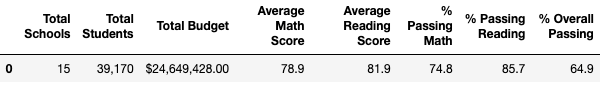
  - The school summary is very slightly impacted. When including the original ninth graders' scores, Thomas High School's average grades ave very similar: the math average grade is higher by tenths of a point with ninth graders included, while the average reading is lower by tenths of a point with ninth graders included. Percentage passing in all categories - math, reading and overall - are greater by similarly small margins with ninth graders included. Below, please find Thomas High School's performance with the ninth graders' scores inluded, followed by the Thomas High School's performance with ninth graders' removed:

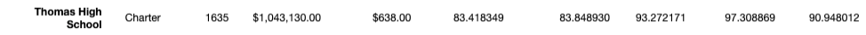
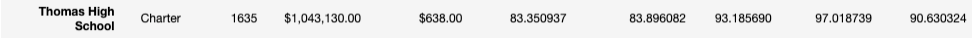
  - Replacing the ninth graders' math and reading scores does not affect Thomas High School's performance relative to the other schools. In both cases, Thomas High School ranks 2nd among top schools, as you see below:
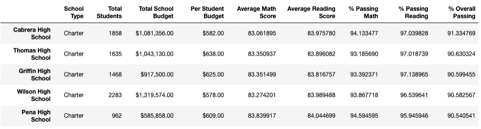
  - Replacing the ninth graders' scores does not impact tenth, eleventh, or twelvth grade scores at all. However, ninth grade scores are listed as "NaN", as you see below (math scores are listed above the reading scores):                           
                          
                                     
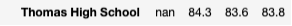                               
  - Replacing the ninth graders' scores does impact scores by spending. Please see below, first with ninth graders' scores included and the second without:        
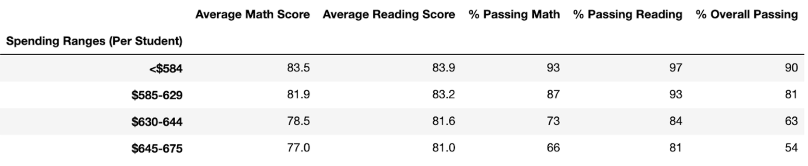
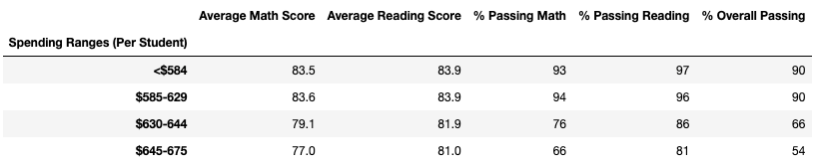
  - Replacing the ninth graders' scores does impact scores by school size. Please see below, first with ninth graders' scores included and the second without:    
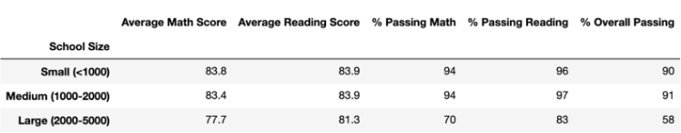
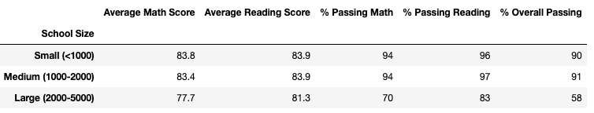
  - Replacing the ninth graders' scores does impact scores by school type. Please see below, first with ninth graders' scores included and the second without:    
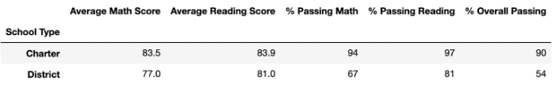
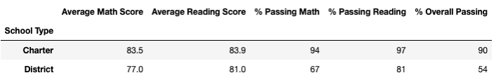

#### Four changes
When we originally replace our reading and math scores for the ninth graders at Thomas High School with NaNs, we see a remarkable difference in performance for Thomas High School. The reason for this is due to the fact that we are still calibrating the percentage of exam achievement based on the original number of students at Thomas High School, which DOES include the ninth graders. This brings all percentages down, as the ninth graders' scores count as "zero" when calibrating averages and passing performance. Below, please see our school summary with Thomas High School grades replaced with NaN but without removing the ninth graders from calibration:                  

We easily see three changes when the ninth graders' scores are replaced with NaNs but they are still included in performance calibrations:
1. The % Passing Math is much lower, by nearly 30%
2. The % Passing Reading is much lower, by nearly 30%
3. The % Passing Overall is much lower, by nearly 30%

We can infer that, with the % Passing rates lowered this dramatically, Thomas High School would be the lowest-ranked school, rather than at its current 2nd rank.
